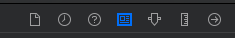

author: Ziv Zalzstein
summary: Create iOS App
id: docs
categories: codelab, swift, ios
environments: ios
status: Published
feedback link: https://github.com/zivz/WeatherApp

# Creating your first iOS App

## First iOS App Overview
Duration: 0:01:30

In the following tutorial, we'll learn how to make an iOS app.  

**General**  
The app will show the user the current weather in its current location.  

**UI**  
The UI Will have a single view.  
The primary view will contain two subviews:  
* A view for the current weather
* A table view for the next 10 days forecast.

**API**  
The app will interact with Open Weather API, in order to fetch the current weather, and the forecast.  

**Location**  
The app will fetch the user's location, upon `When in use authorization` permission

**Notes:**
* The tutorial will focus on Storyboards, Autolayout and UIStackView.  
* The tutorial will include the current weather view only  
* Location Handler, Networking, Parsing code will be provided in order to provide the full capabilities of the app.  
* The app is extendable for further implementation of the next 10 days forecast.  
* Tableview displaying the forecast for the next 10 days implementation is still available in github.  
* The full code is available [here](https://github.com/zivz/WeatherApp).  

**Resources:**
* [Human Interface Guidelines](https://developer.apple.com/design/human-interface-guidelines/ios/overview/)
* [Autolayout](https://www.youtube.com/watch?v=emojd8GFB0o) and [StackView](https://www.youtube.com/watch?v=eF9Ut-VpdAI)
* [Open Weather API](https://openweathermap.org/api).

## Xcode - New Project
Duration: 0:04:00

This tutorial assumes you have basic familiarity with Xcode, as provided in a separate session.

**Resources:**
* [Download Xcode from App Store](https://apps.apple.com/il/app/xcode/id497799835?mt=12)
* [Xcode Essentials](https://www.youtube.com/watch?v=jniJeamcIUU)

#### Create a new Xcode Project

Open Xcode and select "Create a new Xcode Project"  


#### Choose a template for your new project with following options:
iOS | Single View App  


#### Choose options for your new project:
* Product Name - give a meaningful name such as `WeatherApp`
* Organization Name - give your Name or your organization Name
* Organization identifier will be constructed from Organization Name
* Bundle Identifier - will be constructed from your Product Name and Organization Name.
* Language - Swift
* User Interface - Choose Storyboard
* Leave `User Core Data, Include Unit Tests and Include UI Tests` **Unchecked**


#### Edit and Verify Project Settings  
Once the project is created, The project file will appear on the screen.
**Under General tab verify the following:**  
* Verify `Display Name, Bundle Identifier` are correct under `identity`
* Check `iPhone` only, under `Deployment info`
* Check `Portrait` only, under `Device Orientation`


## Weather UI Overview

#### UI Components
Our Primary View will contain 2 Subviews.  
* Current Weather view
* Table View with 10 days weather forecast, **which will not be part of this tutorial.**


#### Current Weather view
Will be consisted of 2 parts   
* Part 1 - General Info
  * Current date
  * Current Temperature in Celsius
  * Current Location
* Part 2 - Weather Description
  * An Image of Weather Type
  * Weather Description


## Current Weather UI Terminology

In this section we'll create the Current Weather UI, using Storyboard, Autolayout and StackView.

#### Storyboard
From [raywanderlich.com](https://www.raywenderlich.com/5055364-ios-storyboards-getting-started) - Storyboards are an exciting feature first introduced in iOS 5, which save time building user interfaces for your apps. Storyboards allow you to prototype and design multiple view controller views within one file, and also let you create transitions between view controllers.

From [apple.com](https://developer.apple.com/library/archive/documentation/General/Conceptual/Devpedia-CocoaApp/Storyboard.html) - A storyboard is a visual representation of the user interface of an iOS application, showing screens of content and the connections between those screens.

#### Autolayout

From [raywanderlich.com](https://www.raywenderlich.com/811496-auto-layout-tutorial-in-ios-getting-started) - At first, Apple made one screen size for the iPhone. Developers didn’t have to create flexible interfaces as they only had to fit that one size. Today, differently sized devices and more emphasis on landscape mode demand user interfaces of different sizes. Auto Layout is Apple’s solution to this problem, enabling UI elements to grow, shrink and move depending on screen size. Auto Layout makes it easy to support different screen sizes in your apps.

#### Constraints

From [SwiftLee](https://www.avanderlee.com/swift/auto-layout-programmatically/) - Auto Layout constraints allow us to create views that dynamically adjust to different size classes and positions. The constraints will make sure that your views adjust to any size changes without having to manually update frames or positions

#### UIStackview
From [apple.com](https://developer.apple.com/documentation/uikit/uistackview) - Stack views let you leverage the power of Auto Layout, creating user interfaces that can dynamically adapt to the device’s orientation, screen size, and any changes in the available space.
The stack view manages the layout of all the views in its arrangedSubviews property. These views are arranged along the stack view’s axis, based on their order in the arrangedSubviews array. The exact layout varies depending on the stack view’s axis, distribution, alignment, spacing, and other properties.


## Creating the basic view

As seen in the image capture below, **Current Weather View** and **Weather Forecast (table) view** are two separate views in the view hold by the view controller.

  
We'll create this view and later pile up our detailed UI Elements.  

We're basically going to add the blue view, holding our detailed UI Elements as in the 3d capture below.


In order to do so, follow the following steps:
1. open Main.storyboard
  1. You should currently see a View inside the View Controller hierarchy.  
  
2. Tap on the `+` Button in the right top corner, in order to reveal the `Object Library`  
  1. Search for `View/UIView` and drag it beneath the View.    
    
  2. You should currently have a view inside your previous view.  
  

### Setting our view constraints

**Before we start follow the steps below, that we'll help us figure out how view looks like:**
* Go to the view attributes, and set its color to `System Teal Color`.  

* change the View name to a meaningful name such as `Current Weather View`

* Run the application and verify your changes.

Negative
: **Notice**: there's a red arrow indicating a problem with your view since it has no set of rules,  
  
In other words we need to `Add constraints` so `Autolayout` will figure out where to position the Current weather view.

In order for our view to be adaptive, we need to set some rules so it will fit several devices:
* Click on Add New Constraints Button  

* Pin the view to the top, leading and trailing edges.
* Add a height of 300.
* Click on Add 4 New Constraints  

* Verify The Missing Constraints error is gone
* Build and run your app.

## Adding Current Weather - General Info UI Elements

We'll add the items as in the image below.  


Follow these steps in order to add the items:
* Step 1: In Object Library (`+` Button) Search For an Image:

* Step 2: Drag the label under the blue view we've previously created.
* Step 3: Copy and Paste The Label Twice, so you'll end up with 3 Labels.
* Step 4: By clicking on the Labels give them meaningful names:
  * `Current Date` for the top label
  * `Current Temp` for the middle Label
  * `Current Location` for the bottom Label
* Step 5: Your Interface builder should look like that  


## Creating Current Weather - General Info Stackview

As specified in Weather UI overview, the current weather UI will be consisted of two views.
Those Views are marked in the image below in <font color="red">red</font>, and <font color="green">green</font>.
The red view refers to the General Info View, while the green view refers to the weather description view.


Using Stack Views will ease our development process, simplify our constraints logic and will be easier if we'll want to make changes in our UI in the future.
Using Stack Views comes naturally as one view, can be "treated" as an array of 3 vertical elements, while the other has 2 vertical elements.

Negative
: As Stack Views are really confusing in the beginning, play with the different options  
other than those suggested in the paragraph below, In order to notice the difference.

#### The Current Weather General Info Stack View Properties
* Axis - As Our elements are stacked vertically, we'll choose `Vertical`.
* Alignment - We'd like our elements to fill the container, we'll choose `Fill`.
* Distribution - We'd like our elements to be distributed as a proportions of their label size, hence we'll choose `Fill Proportionally`.
* Spacing - is redundant here since Our Distribution defines the way the items will be spaced.


## Adding Current Weather - Description UI Elements

We'll add the items as in the image below.  


Follow these steps in order to add the items:
* Step 1: In Object Library (`+` Button) Search For an Image:

* Step 2: Drag the image under the blue view we've previously created.
* Step 3: In Object Library (`+` Button) Search For a Label:

* Step 4: Drag the label under the blue view we've previously created.
* Step 5: By clicking on the Items give them meaningful names:
  * `Description Image` for the Image
  * `Description Label` for the middle Label
* Step 6: Your Interface builder should look like that  


## Creating Current Weather - Description Stackview

#### Current Weather Description Stack View properties
* Axis - As our elements are stacked vertically, we'll choose `Vertical`.
* Alignment - We'd like our elements to be in the Center of the container, we'll choose `Center`.
* Distribution - We'd like our elements to be vertically stretched in the container, hence, we'll choose `Fill`.


## Setting constraints for our Stackviews
Now that we have two Stackviews, we need to constraint them to the view, and each other.

#### Adding constraints to the `Info Stackview`:
* Step 1: Click on the Info Stack View, then on `Add New Constraints`
  * Pin the stack view 20 pts to the top of the view
  * Pin the stack view 20 pts to the bottom of the view
  * Pin the stack view 20 pts to the leading edge of the view
* Step 2: We still need a constrain to the trailing edge,
  * We'll solve that by adding constraints to the Description stack view.

#### Adding constraints to the `Description Stack View`:
* Step 1: Click on the Description Stack View then on `Add New Constraints`
  * Pin the stack view 100 pts to the top of the view
  * Pin the stack view 20 pts to the bottom of the view
  * Pin the stack view 20 pts to the trailing of the view
* Step 2: Add a constrain related to the Info stack view:
  * The constrain should reflect that the leading Image Stack View will be 20 pts from the trailing edge of the Info Stack View

Your constraints should look as following:  


## Adding Assets to our Project
As part of our data model, we'll parse the weather description, and map it to a local asset.  
In order to do so, go ahead and
<a href="https://github.com/zivz/weatherapp_codelab/raw/master/resources/UI_Assets.zip" download>Download Image Assets</a>

Once a weather description will be parsed, it will be associated to a local image in our assets and then will be displayed to our user.

In order to import the resources to our project, simply go to `Assets.xcassets` folder and drag the images after being extracted from the attached zip.

## Preparing our Network Manager - Part 1
Before we begin go to our project navigator, and create a new group, named `Managers`.
In order to so, right click on Weather App Folder and Choose `Create New Group`
A group in Xcode was used to be a "FAKE" folder, but now a days a group is actually a folder.
A group without folder is used in order to organize files in your project without affecting the structure on the actual file system.  

You can read more about groups and folder in [stackoverflow.com](https://stackoverflow.com/questions/34207664/difference-between-folder-and-group-in-xcode)

Follow these steps in order to create our Network Manager file:
1. Right click our new group, named `Network Manager` c
2. Choose New file..
3. Choose `Swift`
4. name it `NetworkManager.swift`

#### Open Weather API
In order to fetch data from the network, we'll be using open weather api.
Feel free to self explore the API, but for now we'll use the `Current Weather API` only.  

In order to get the current weather, there are several options:
* Get the weather by city name
* Get the weather by city id
* Get the weather by geographic coordinates. **This is the request we'll be using**
* Get the weather by zip code

#### Getting weather by geographic coordinates
As specified in [Current Weather API](https://openweathermap.org/current)  
We'll need to pass the network call the latitude and longitude coordinates, as well as an api key.
In order to create an api key, you'll be required to [Subscribe](https://openweathermap.org/appid) to Open weather API.

The API call will look as so:  
`api.openweathermap.org/data/2.5/weather?lat={lat}&lon={lon}&appid={your api key}`

#### Creating a structure for our End Point
In `NetworkManager.swift` We'll insert a structure for our end point.
The structure is using URL Components, will save us typos, bugs and will be easier to use, later in our API Calls.
The structure is based on [Constructing URLs in Swift article](https://www.swiftbysundell.com/articles/constructing-urls-in-swift)

go ahead and copy these lines to our `NetworkManager.swift`  
```swift
private struct EndPoints {
    private struct Path {
        static let weather = "/data/2.5/weather"
    }

    private static let base_url = "api.openweathermap.org"

    private struct QueryParams {
        static let latitude = "lat"
        static let longitude = "lon"
        static let app_id = "appid"
        static let mode = "mode"
        static let units = "units"
    }

    private struct QueryValues {
        static let api_key = "insert your apikey"
        static let units = "metric"
        static let latitude = Location.shared.latitude!
        static let longitude = Location.shared.longitude!
    }

    static var currentWeatherURL: URL? {
        var components = URLComponents()
        components.scheme = "https"
        components.host = EndPoints.base_url
        components.path = Path.weather
        components.queryItems = [
            URLQueryItem(name: QueryParams.latitude, value: String(Location.shared.latitude!)),
            URLQueryItem(name: QueryParams.longitude, value: String(Location.shared.longitude!)),
            URLQueryItem(name: QueryParams.app_id, value: QueryValues.api_key),
            URLQueryItem(name: QueryParams.units, value: QueryValues.units)
        ]

        return components.url

    }
```

## Preparing our Network Manager - Part 2
Will now create our Network Manager, the Network Manager is a singleton.

#### Create our singleton
Copy these lines of code, under our EndPoints structure.
```swift
class NetworkManager {
  static let shared = NetworkManager()
  private init() {}
}
```

By using private init() our NetworkManager cannot be instantiated more than once, hence, it's a singleton.

#### Creating our currentWeather Network Call
Our network call will not get any outside parameters, but rather be using our location coordinates, which will be accessed through a singleton as well.
We'll use the enumeration to capture information about whether an asynchronous call succeeds or fails, and use the associated values for the `Result.success(_:)` and `Result.failure(_:)` cases to carry information about the result of the call.
To read more about using result, I've found [this article](https://www.hackingwithswift.com/articles/161/how-to-use-result-in-swift) very helpful.

Go ahead an declare our function under `private init() {}` declaration.
```swift

func getCurrentWeather(completionHandler: @escaping (Result<CurrentWeather, WeatherError>) -> Void ) {

}
```

Notice that we're using our CurrentWeather, and WeatherError as the success and failure cases.
We'll create the `Current Weather Model` and `WeatherError` very soon.

#### Creating our data task
Our data task, which will handle the api call will be consisted from constructing the url, firing the request and handling the response.

Let's create the url

in our function, copy and paste these lines of code:
```swift
guard let url = EndPoints.currentWeatherURL else {
    completionHandler(.failure(.invalidURL))
    return
}
```

This part was easy, since we were using our EndPoints structure.
We also had to handle an error, since the url is optional and we don't want to continue if the url is `nil`.
In that case we'll return a failure case, the failure case is expecting an error, so we provided our WeatherError enum with invalidUrl.

Let's fire our task, will be using URLSession.  
URLSession provides and API for downloading data from and uploading data to endpoints indicated by URLs.
You can read more about URLSession [here](https://developer.apple.com/documentation/foundation/urlsession), [here](https://www.raywenderlich.com/3244963-urlsession-tutorial-getting-started) and [here](https://learnappmaking.com/urlsession-swift-networking-how-to/)

under our guard statement, copy and paste this line of code

```Swift
let task = URLSession.shared.dataTask(with: url) { data, response, error in

}
```

We now see that our dataTask, using the url we've created, the completionHandler of the task either returns us data, response and error.

#### Handling the error  
error means there was a transport error, either by sending the request, or receiving the response.

to handle the error copy and paste these lines of code:
```Swift
if let _ = error {
    completionHandler(.failure(.unableToComplete))
    return
}
```

#### Handling the response
We're expecting for response code of 200, so any other response code will indicate us an error.
to handle responses other than 200, copy and paste these lines of code:
```Swift
guard let response = response as? HTTPURLResponse, response.statusCode == 200 else {
    completionHandler(.failure(.unableToComplete))
    return
}
```

####Handling our data
We're expecting for data, so we'll again handle the case we don't get any data.
to handle corrupted data, copy and paste these lines of code:
```Swift
guard let data = data else {
    completionHandler(.failure(.invalidData))
    return
}
```
####Decoding our data
We'll be using JSONDecoder, since our data will be serialized to JSON,
Then we'd like to parse our JSON into an object, which will be our DecodedWeather structure.
We'll then map for our own convenience DecodedWeather to CurrentWeather which will contain the data in the structure we want.

go ahead and copy these lines of code under data closing braces:
```Swift
do {
    let decoder = JSONDecoder()
    let decodedWeather = try decoder.decode(DecodedWeather.self, from: data)
    let currentWeather = CurrentWeather(weather: decodedWeather)
    completionHandler(.success(currentWeather))
} catch {
    completionHandler(.failure(.invalidData))
}
```

####Firing the request
After the closing braces of our task, insert `task.resume()`
This line of code will fire our request.

## Preparing our Data model
After fetching our data, using the getCurrentWeather request, we'll be using JSON decoder and get our object in hand.
We'll use decodable for parsing our data.
Then map our structure to another structure, for our own convenience.

#### Creating a group for our data model
In order to so, right click on Weather App Folder and Choose `Create New Group`
Name the group `Model`

Follow these steps in order to create our Network Manager file:
1. Right click our new group, named `Model`
2. Choose New file..
3. Choose `Swift`
4. Name it `CurrentWeather.swift`

By examining our response, we need to decode the following pieces:

from the first hierarchy we'll need:
* "name" for the Location label

from weather structure, we'll need:
* "main" for weather description and image.

from main structure, we'll need:
* "temp" for weather description.

The current date label will not be taken from the network response.

```
{
    "coord": {
        "lon": 34.91,
        "lat": 31.99
    },
    "weather": [
        {
            "id": 802,
            "main": "Clouds",
            "description": "scattered clouds",
            "icon": "03d"
        }
    ],
    "base": "stations",
    "main": {
        "temp": 20.12,
        "feels_like": 16.12,
        "temp_min": 17.78,
        "temp_max": 21.67,
        "pressure": 1019,
        "humidity": 46
    },
    "visibility": 10000,
    "wind": {
        "speed": 5.1,
        "deg": 290
    },
    "clouds": {
        "all": 43
    },
    "dt": 1582806769,
    "sys": {
        "type": 1,
        "id": 6845,
        "country": "IL",
        "sunrise": 1582776663,
        "sunset": 1582817744
    },
    "timezone": 7200,
    "id": 294421,
    "name": "Lod",
    "cod": 200
}
```

#### Decoding the Current Weather
In `CurrentWeather.swift`, copy and paste.
```Swift
// MARK: - CurrentWeather
struct DecodedWeather: Decodable {

    let weather: [Weather]
    let main: Main
    let cityName: String

    enum CodingKeys: String, CodingKey {
        case weather, main
        case cityName = "name"
    }
}

// MARK: - Main
struct Main: Decodable {
    let temp: Double
}

// MARK: - Weather
struct Weather: Decodable {
    let type: String

    enum CodingKeys: String, CodingKey {
        case type = "main"
    }
}
```

#### Mapping DecodedWeather to CurrentWeather  
Let's go ahead and create  `CurrentWeather` structure, that will be used for mapping the decoded response for our convenience.
```Swift
struct CurrentWeather: Codable {

    let currentTemp: Int
    let weatherType: String
    let cityName: String

    init(weather: DecodedWeather) {
        self.currentTemp = Int(weather.main.temp.rounded(.toNearestOrEven))
        self.weatherType = weather.weather.first?.type ?? ""
        self.cityName = weather.cityName
    }
}
```

## Creating Location Model
In order to save the location, retrieved by `Core Location` and upon `When in use authorization` permission  
we'll create another file for saving the `Location` Model.

Follow these steps in order to create our Location file:
1. Right click our new group, named `Utilities`
2. Choose New file..
3. Choose `Swift`
4. Name it `Location.swift`

Add the following code, so we'll have Location as singleton, we'll also need to save only two attributes, which are the `latitude` and `longitude`.

```Swift
class Location {
    static var shared = Location()

    private init() {}

    var latitude: Double!
    var longitude: Double!
}
```

## Creating WeatherError
In order to handle the various cases of network errors, we'll create a new group, named `Utilities`.

Follow these steps in order to create our WeatherError file:
1. Right click our new group, named `Utilities`
2. Choose New file..
3. Choose `Swift`
4. Name it `WeatherError.swift`   

create the following cases by copy and pasting these lines of code:
```Swift
enum WeatherError: String, Error {
    case invalidResponse = "Invalid response from the server"
    case invalidURL = "Invalid url"
    case unableToComplete = "Unable to complete your request. Please check your internet connection"
    case invalidData = "The data received from the server was corrupted. Please try again"
}
```

## Date Formatting
`Swift` Foundation provides us to get the current date.
This is required in order to display the current date label, but the format we'll be using doesn't match our needs.

We'll create an extension for `Date` and use it to display the date in the format we want.

Create a new group, named `Extensions`
Follow these steps in order to create our Date+Ext file:
1. Right click our new group, named `Extensions`
2. Choose New file..
3. Choose `Swift`
4. Name it `Date+Ext.swift`   

Using [this web site](https://nsdateformatter.com), allows to easily deal with formatting.
Since we want our Date to Include Month, day and year we'll play with the format in the above link and copy the format.  
![Date Format][./assets/DateFormat.png]

in our file, insert the following code:
```Swift
func currentDate() -> String {
    let dateFormatter = DateFormatter()
    dateFormatter.dateFormat = "MMMM dd, yyyy"
    let currentDate = dateFormatter.string(from: Date())
    return "Today, \(currentDate)"
}
```

Alternatively we can use this code, I've found while searching in [stackoverflow](https://stackoverflow.com/questions/24100855/set-a-datestyle-in-swift)
```Swift
func currentDate() -> String {
    let dateFormatter = DateFormatter()
    dateFormatter.dateStyle = .long
    dateFormatter.timeStyle = .none
    let currentDate = dateFormatter.string(from: Date())
    return "Today, \(currentDate)"
}
```


## Connecting the UI To Our View controller

#### Renaming our View controller
In order to rename our view controller follows these steps:
1. In Project Navigator click on `ViewController.swift`
2. Click again, and rename to `WeatherVC.swift`
3. Open the file and change the class name:
  * In the description heather
  * In the class declaration
4. **Our Storyboard doesn't know who's WeatherVC**, Open `Main.storyboard`
  * Click on the View Controller Scene
  * In utilities pane click on `identity inspector`  
  
  * Change the class in custom class to `WeatherVC`

## Connecting outlets from interface builder
In order that `WeatherVC` will handle the logic for
