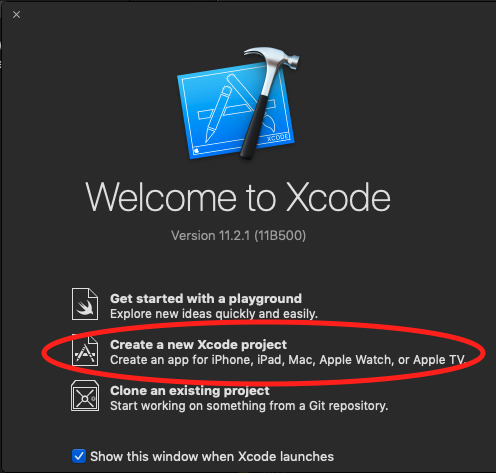
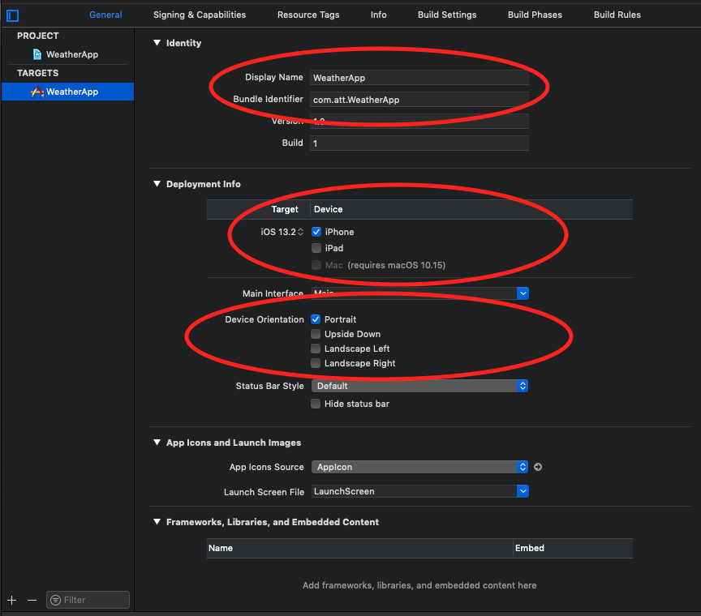
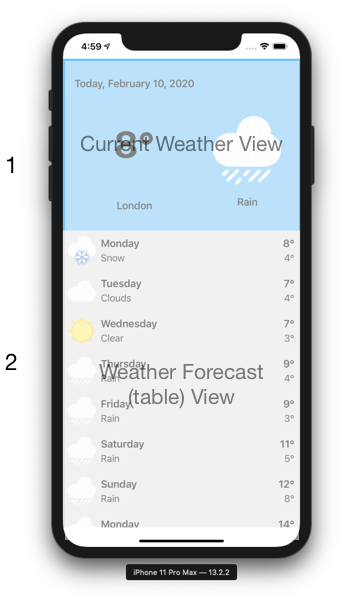
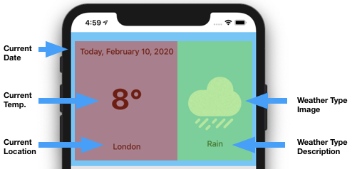

author: Ziv Zalzstein
summary: Create iOS App
id: docs
categories: codelab, swift, ios
environments: ios
status: Published
feedback link: https://github.com/zivz/WeatherApp

# Creating your first iOS App

## First iOS App Overview
Duration: 0:01:30

In the following tutorial, we'll learn how to make an iOS app.  

**General**  
The app will show the user the current weather in its current location.  

**UI**  
The UI Will have a single view.  
The primary view will contain two subviews:  
* A view for the current weather
* A table view for the next 10 days forecast.

**API**  
The app will interact with Open Weather API, in order to fetch the current weather, and the forecast.  

**Location**  
The app will fetch the user's location, upon `When in use authorization` permission

**Notes:**
* The tutorial will focus on Storyboards, Autolayout and UIStackView.  
* The tutorial will include the current weather view only  
* Location Handler, Networking, Parsing code will be provided in order to provide the full capabilities of the app.  
* The app is extendable for further implementation of the next 10 days forecast.  
* Tableview displaying the forecast for the next 10 days implementation is still available in github.  
* The full code is available [here](https://github.com/zivz/WeatherApp).  

**Resources:**
* [Human Interface Guidelines](https://developer.apple.com/design/human-interface-guidelines/ios/overview/)
* [Autolayout](https://www.youtube.com/watch?v=emojd8GFB0o) and [StackView](https://www.youtube.com/watch?v=eF9Ut-VpdAI)
* [Open Weather API](https://openweathermap.org/api).

## Xcode - New Project
Duration: 0:04:00

This tutorial assumes you have basic familiarity with Xcode, as provided in separate session.

**Resources:**
* [Download Xcode from App Store](https://apps.apple.com/il/app/xcode/id497799835?mt=12)
* [Xcode Essentials](https://www.youtube.com/watch?v=jniJeamcIUU)

#### Create a new Xcode Project

Open Xcode and select "Create a new Xcode Project"  

#### Choose a template for your new project with following options:
iOS | Single View App  

#### Choose options for your new project:
* Product Name - give a meaningful name such as `WeatherApp`
* Organization Name - give your Name or your organization Name
* Organization identifier will be constructed from Organization Name
* Bundle Identifier - will be constructed from your Product Name and Organization Name.
* Language - Swift
* User Interface - Choose Storyboard
* Leave `User Core Data, Include Unit Tests and Include UI Tests` **Unchecked**

#### Edit and Verify Project Settings  
Once the project is created, The project file will appear on the screen.
**Under General tab verify the following:**  
* Verify `Display Name, Bundle Identifier` are correct under `identity`
* Check `iPhone` only, under `Deployment info`
* Check `Portrait` only, under `Device Orientation`

## Weather UI Overview

#### UI Components
Our Primary View will contain 2 Subviews.  
* Current Weather view
* Table View with 10 days weather forecast, **which will not be part of this tutorial.**

#### Current Weather view
Will be consisted of 2 parts   
* Part 1  
  * Current day
  * Current Temperature in Celsius
  * Current Location
* Part 2
  * An Image of Weather Type
  * Weather Description

## Creating Current Weather UI  

In this section we'll create the Current Weather UI, using Storyboard, Autolayout and StackView.

#### Storyboard
From [raywanderlich.com](https://www.raywenderlich.com/5055364-ios-storyboards-getting-started) - Storyboards are an exciting feature first introduced in iOS 5, which save time building user interfaces for your apps. Storyboards allow you to prototype and design multiple view controller views within one file, and also let you create transitions between view controllers.

From [apple.com](https://developer.apple.com/library/archive/documentation/General/Conceptual/Devpedia-CocoaApp/Storyboard.html) - A storyboard is a visual representation of the user interface of an iOS application, showing screens of content and the connections between those screens.

#### Autolayout

From [raywanderlich.com](https://www.raywenderlich.com/811496-auto-layout-tutorial-in-ios-getting-started) - At first, Apple made one screen size for the iPhone. Developers didn’t have to create flexible interfaces as they only had to fit that one size. Today, differently sized devices and more emphasis on landscape mode demand user interfaces of different sizes. Auto Layout is Apple’s solution to this problem, enabling UI elements to grow, shrink and move depending on screen size. Auto Layout makes it easy to support different screen sizes in your apps.

#### Constraints

From [SwiftLee](https://www.avanderlee.com/swift/auto-layout-programmatically/) - Auto Layout constraints allow us to create views that dynamically adjust to different size classes and positions. The constraints will make sure that your views adjust to any size changes without having to manually update frames or positions

#### UIStackview
From [apple.com](https://developer.apple.com/documentation/uikit/uistackview) - Stack views let you leverage the power of Auto Layout, creating user interfaces that can dynamically adapt to the device’s orientation, screen size, and any changes in the available space.
The stack view manages the layout of all the views in its arrangedSubviews property. These views are arranged along the stack view’s axis, based on their order in the arrangedSubviews array. The exact layout varies depending on the stack view’s axis, distribution, alignment, spacing, and other properties.
[Stack view - Apple developer](https://docs-assets.developer.apple.com/published/82128953f6/uistack_hero_2x_04e50947-5aa0-4403-825b-26ba4c1662bd.png)
