author: Ziv Zalzstein
summary: Create iOS App
id: docs
categories: codelab, swift, ios
environments: ios
status: Published
feedback link: https://github.com/zivz/WeatherApp

# Creating your first iOS App

## First iOS App Overview
Duration: 0:01:30

In the following tutorial, we'll learn how to make an iOS app.  

**General**  
The app will show the user the current weather in its current location.  

**UI**  
The UI Will have a single view.  
The primary view will contain two subviews:  
* A view for the current weather
* A table view for the next 10 days forecast.

**API**  
The app will interact with Open Weather API, in order to fetch the current weather, and the forecast.  

**Location**  
The app will fetch the user's location, upon `When in use authorization` permission

**Notes:**
* The tutorial will focus on Storyboards, Autolayout and UIStackView.  
* The tutorial will include the current weather view only  
* Location Handler, Networking, Parsing code will be provided in order to provide the full capabilities of the app.  
* The app is extendable for further implementation of the next 10 days forecast.  
* Tableview displaying the forecast for the next 10 days implementation is still available in github.  
* The full code is available [here](https://github.com/zivz/WeatherApp).  

**Resources:**
* [Human Interface Guidelines](https://developer.apple.com/design/human-interface-guidelines/ios/overview/)
* [Autolayout](https://www.youtube.com/watch?v=emojd8GFB0o) and [StackView](https://www.youtube.com/watch?v=eF9Ut-VpdAI)
* [Open Weather API](https://openweathermap.org/api).

## Xcode - New Project
Duration: 0:04:00

This tutorial assumes you have basic familiarity with Xcode, as provided in a separate session.

**Resources:**
* [Download Xcode from App Store](https://apps.apple.com/il/app/xcode/id497799835?mt=12)
* [Xcode Essentials](https://www.youtube.com/watch?v=jniJeamcIUU)

#### Create a new Xcode Project

Open Xcode and select "Create a new Xcode Project"  

#### Choose a template for your new project with following options:
iOS | Single View App  

#### Choose options for your new project:
* Product Name - give a meaningful name such as `WeatherApp`
* Organization Name - give your Name or your organization Name
* Organization identifier will be constructed from Organization Name
* Bundle Identifier - will be constructed from your Product Name and Organization Name.
* Language - Swift
* User Interface - Choose Storyboard
* Leave `User Core Data, Include Unit Tests and Include UI Tests` **Unchecked**

#### Edit and Verify Project Settings  
Once the project is created, The project file will appear on the screen.
**Under General tab verify the following:**  
* Verify `Display Name, Bundle Identifier` are correct under `identity`
* Check `iPhone` only, under `Deployment info`
* Check `Portrait` only, under `Device Orientation`

## Weather UI Overview

#### UI Components
Our Primary View will contain 2 Subviews.  
* Current Weather view
* Table View with 10 days weather forecast, **which will not be part of this tutorial.**

#### Current Weather view
Will be consisted of 2 parts   
* Part 1 - General Info
  * Current date
  * Current Temperature in Celsius
  * Current Location
* Part 2 - Weather Description
  * An Image of Weather Type
  * Weather Description

## Current Weather UI Terminology

In this section we'll create the Current Weather UI, using Storyboard, Autolayout and StackView.

#### Storyboard
From [raywanderlich.com](https://www.raywenderlich.com/5055364-ios-storyboards-getting-started) - Storyboards are an exciting feature first introduced in iOS 5, which save time building user interfaces for your apps. Storyboards allow you to prototype and design multiple view controller views within one file, and also let you create transitions between view controllers.

From [apple.com](https://developer.apple.com/library/archive/documentation/General/Conceptual/Devpedia-CocoaApp/Storyboard.html) - A storyboard is a visual representation of the user interface of an iOS application, showing screens of content and the connections between those screens.

#### Autolayout

From [raywanderlich.com](https://www.raywenderlich.com/811496-auto-layout-tutorial-in-ios-getting-started) - At first, Apple made one screen size for the iPhone. Developers didn’t have to create flexible interfaces as they only had to fit that one size. Today, differently sized devices and more emphasis on landscape mode demand user interfaces of different sizes. Auto Layout is Apple’s solution to this problem, enabling UI elements to grow, shrink and move depending on screen size. Auto Layout makes it easy to support different screen sizes in your apps.

#### Constraints

From [SwiftLee](https://www.avanderlee.com/swift/auto-layout-programmatically/) - Auto Layout constraints allow us to create views that dynamically adjust to different size classes and positions. The constraints will make sure that your views adjust to any size changes without having to manually update frames or positions

#### UIStackview
From [apple.com](https://developer.apple.com/documentation/uikit/uistackview) - Stack views let you leverage the power of Auto Layout, creating user interfaces that can dynamically adapt to the device’s orientation, screen size, and any changes in the available space.
The stack view manages the layout of all the views in its arrangedSubviews property. These views are arranged along the stack view’s axis, based on their order in the arrangedSubviews array. The exact layout varies depending on the stack view’s axis, distribution, alignment, spacing, and other properties.
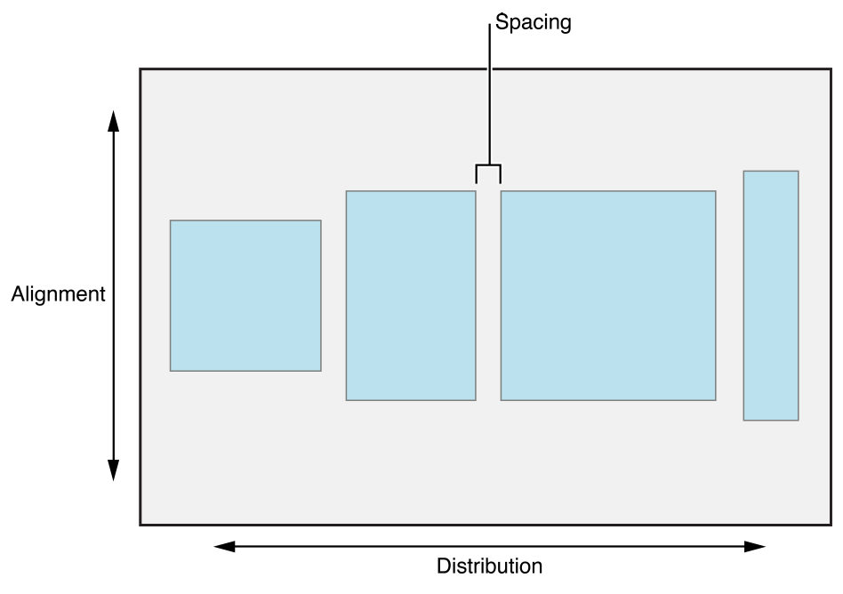

## Creating the basic view

As seen in the image capture below, **Current Weather View** and **Weather Forecast (table) view** are two separate views in the view hold by the view controller.

  
We'll create this view and later pile up our detailed UI Elements.  

We're basically going to add the blue view, holding our detailed UI Elements as in the 3d capture below.
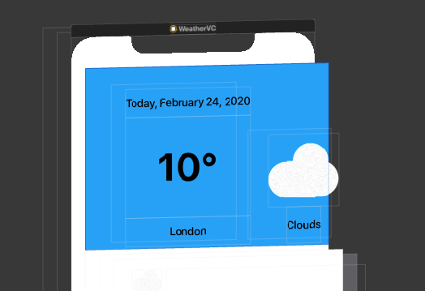

In order to do so, follow the following steps:
1. open Main.storyboard
  1. You should currently see a View inside the View Controller hierarchy.  
  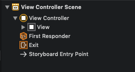
2. Tap on the `+` Button in the right top corner, in order to reveal the `Object Library`  
  1. Search for `view` and drag it beneath the View.    
  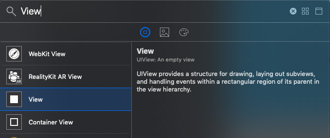  
  2. You should currently have a view inside your previous view.  
  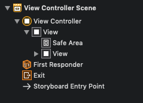

### Setting our view constraints

**Before we start follow the steps below, that we'll help us figure out how view looks like:**
* Go to the view attributes, and set its color to `System Teal Color`.
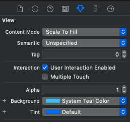
* change the View name to a meaningful name such as `Current Weather View`
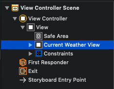
* Run the application and verify your changes.

Negative
: you should currently notice a red arrow indicating there's a problem with your view since it has no set of rules,  
or in other words we need to set constraints so `Autolayout` will figure out where to position the view.

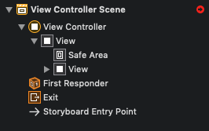

In order for our view to be adaptive, we need to set some rules so it will fit several devices:
* Click on Add New Constraints Button  
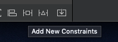
* Pin the view to the top, leading and trailing edges.
* Add a height of 300.
* Click on Add 4 New Constraints  
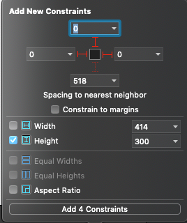
* Verify The Missing Constraints error is gone
* Build and run your app.

## Adding Current Weather - General Info UI Elements

We'll add the items as in the image below.  
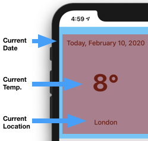

Follow these steps in order to add the items:
* Step 1: In Object Library (`+` Button) Search For an Image:
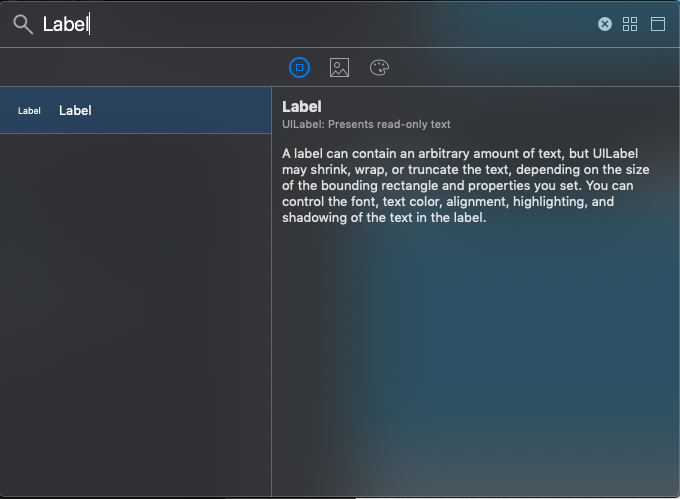
* Step 2: Drag the label under the blue view we've previously created.
* Step 3: Copy and Paste The Label Twice, so you'll end up with 3 Labels.
* Step 4: By clicking on the Labels give them meaningful names:
  * `Current Date` for the top label
  * `Current Temp` for the middle Label
  * `Current Location` for the bottom Label
* Step 5: Your Interface builder should look like that  
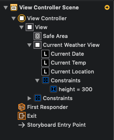

## Creating Current Weather - General Info Stackview

As specified in Weather UI overview, the current weather UI will be consisted of two views.
Those Views are marked in the image below in red, and green.
The red view refers to the General Info View, while the green view refers to the weather description view.

Using Stack Views will ease our development process, simplify our constraints logic and will be easier if we'll want to make changes in our UI in the future.
Using Stack Views comes naturally as one view, can be "treated" as an array of 3 vertical elements, while the other has 2 vertical elements.

Negative
: As Stack Views are really confusing in the beginning, play with the different options  
other than those suggested in the paragraph below, In order to notice the difference.

#### The Current Weather General Info Stack View Properties
* Axis - As Our elements are stacked vertically, we'll choose `Vertical`.
* Alignment - We'd like our elements to fill the container, we'll choose `Fill`.
* Distribution - We'd like our elements to be distributed as a proportions of their label size, hence we'll choose `Fill Proportionally`.
* Spacing - is redundant here since Our Distribution defines the way the items will be spaced.

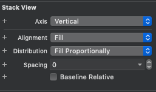

## Adding Current Weather - Description UI Elements

We'll add the items as in the image below.  
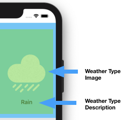

Follow these steps in order to add the items:
* Step 1: In Object Library (`+` Button) Search For an Image:
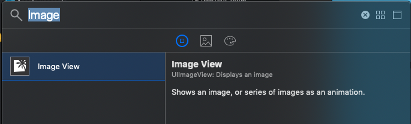
* Step 2: Drag the image under the blue view we've previously created.
* Step 3: In Object Library (`+` Button) Search For a Label:

* Step 4: Drag the label under the blue view we've previously created.
* Step 5: By clicking on the Items give them meaningful names:
  * `Description Image` for the Image
  * `Description Label` for the middle Label
* Step 6: Your Interface builder should look like that  
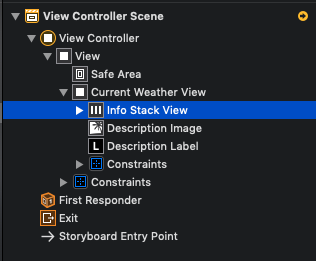

## Creating Current Weather - Description Stackview

#### Current Weather Description Stack View properties
* Axis - As our elements are stacked vertically, we'll choose `Vertical`.
* Alignment - We'd like our elements to be in the Center of the container, we'll choose `Center`.
* Distribution - We'd like our elements to be vertically stretched in the container, hence, we'll choose `Fill`.

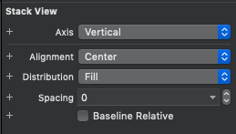

## Setting constraints for our Stackviews
Now that we have two Stackviews, we need to constraint them to the view, and each other.

We'll start with adding constraints to the `Info Stackview`:
* Step 1: Click on the Info Stack View, then on `Add New Constraints`
  * Pin the stack view 20 pts to the top of the view
  * Pin the stack view 20 pts to the bottom of the view
  * Pin the stack view 20 pts to the leading edge of the view
* Step 2: We still need a constrain to the trailing edge,
  * We'll solve that by adding constraints to the Description stack view.

Go ahead by adding constraints to the `Description Stack View`:
* Step 1: Click on the Description Stack View then on `Add New Constraints`
  * Pin the stack view 100 pts to the top of the view
  * Pin the stack view 20 pts to the bottom of the view
  * Pin the stack view 20 pts to the trailing of the view
* Step 2: Add a constrain related to the Info stack view:
  * The constrain should reflect that the leading Image Stack View will be 20 pts from the trailing edge of the Info Stack View

Your constraints should look as following:
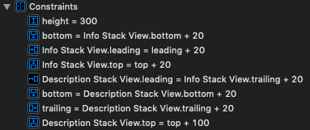
